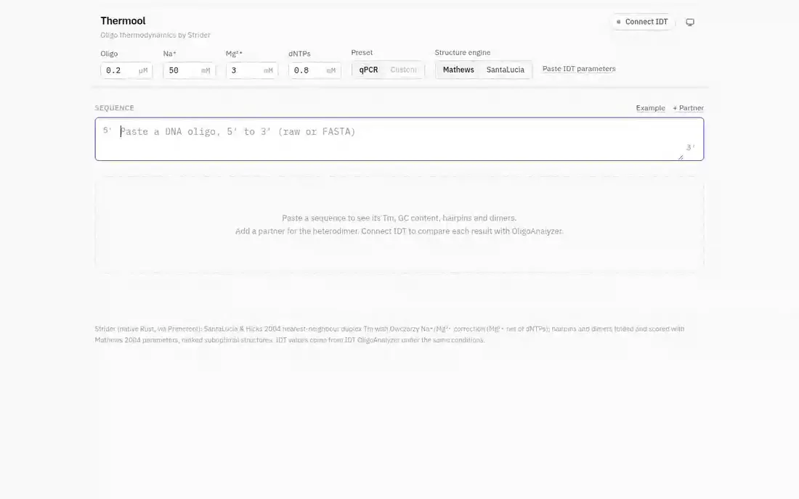
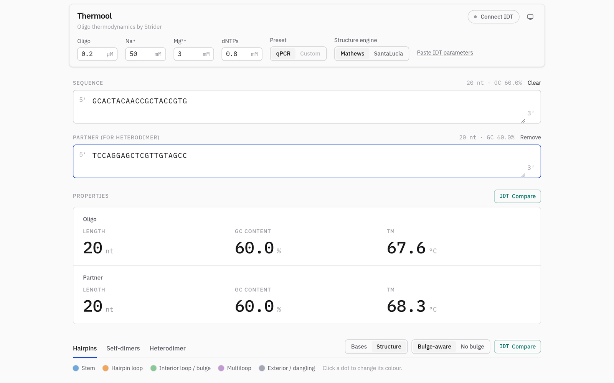
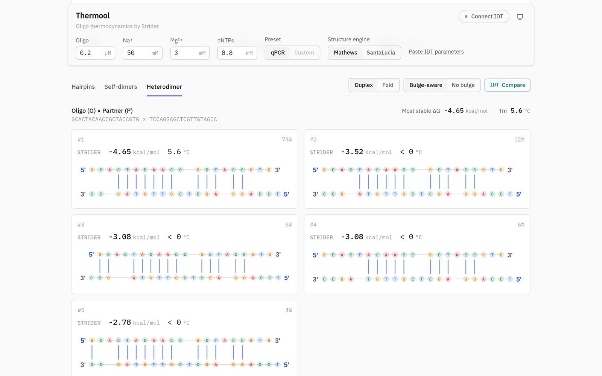
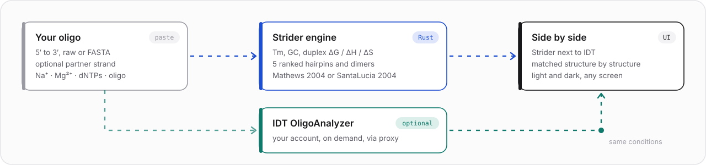

<div align="center">

<picture>
  <source media="(prefers-color-scheme: dark)" srcset="docs/assets/hero-dark.svg" />
  
</picture>

<br />
<br />

[](src)
[](frontend)
[](frontend)
[](frontend)

[](https://github.com/EmilioVenegas/strider)
[](https://www.idtdna.com/pages/tools/oligoanalyzer)
[](#two-engines-one-switch)
[](#a-closer-look)

**Paste an oligo. Get its Tm, GC content, hairpins and dimers in milliseconds,<br />drawn as structures, and check every number against IDT with one click.**

[**Features**](#features) · [**Quick start**](#quick-start) · [**How it works**](#how-it-works) · [**IDT**](#idt-oligoanalyzer-side-by-side) · [**API**](#http-api)

</div>

<br />

<picture>
  <source media="(prefers-color-scheme: dark)" srcset="docs/assets/demo-dark.webp" />
  
</picture>

<br />

## Features

<table>
  <tr>
    <td width="33%" valign="top">
      <h3>Instant</h3>
      Results update as you type. A 150-mer with a partner strand is fully analysed in about 40 ms by Strider's native Rust core.
    </td>
    <td width="33%" valign="top">
      <h3>Structures you can see</h3>
      The five most stable hairpins, self-dimers and heterodimers, ranked, each drawn as a Strider fold or a duplex with ΔG, Tm and its share of the population. Colour bases by nucleotide or by structure: stem, loop, bulge, dangling end.
    </td>
    <td width="33%" valign="top">
      <h3>IDT next to Strider</h3>
      One button per analysis sends the same oligo and conditions to IDT OligoAnalyzer. IDT's structure lands on the Strider structure it matches.
    </td>
  </tr>
  <tr>
    <td valign="top">
      <h3>Your conditions</h3>
      Na⁺, Mg²⁺, dNTPs and oligo concentration in IDT's units, starting from a qPCR preset you can edit freely. Paste IDT's parameter text and every field fills itself.
    </td>
    <td valign="top">
      <h3>Two engines</h3>
      Fold and score with Mathews 2004 (closest to IDT) or SantaLucia 2004, Strider's native set. Flip the switch and every structure is recomputed.
    </td>
    <td valign="top">
      <h3>Calm by design</h3>
      A quiet, typographic interface in light and dark, with a floating settings bar that stays in reach while you scroll. Works down to phone width.
    </td>
  </tr>
</table>

## A closer look

<table>
  <tr>
    <td width="50%">
      <picture>
        <source media="(prefers-color-scheme: dark)" srcset="docs/assets/overview-dark.png" />
        
      </picture>
      <p align="center"><sub><b>Overview.</b> Settings stay pinned on top; length, GC and Tm are the headline.</sub></p>
    </td>
    <td width="50%">
      <picture>
        <source media="(prefers-color-scheme: dark)" srcset="docs/assets/dimers-dark.png" />
        
      </picture>
      <p align="center"><sub><b>Heterodimers.</b> Ranked duplexes between oligo and partner, with ΔG, Tm and share.</sub></p>
    </td>
  </tr>
</table>

## Quick start

Thermool needs **Rust**, **Node.js**, and a [**Primerool**](https://github.com/KowalskiBio/Primerool) checkout next to it: Thermool builds against Primerool's `engine` and `thermo-core` crates, the native Rust port of Strider.

```bash
git clone https://github.com/KowalskiBio/Primerool.git
git clone https://github.com/KowalskiBio/Thermool.git
cd Thermool

(cd frontend && npm install && npm run build)
cargo run --release
```

Open **http://127.0.0.1:5070** and press **Example**.

> [!TIP]
> Working on the interface? Keep the server running and start `npm run dev` in `frontend/`. Vite serves the UI with hot reload and proxies `/api` to the server.

| Variable | Default | Purpose |
|---|---|---|
| `THERMOOL_ADDR` | `127.0.0.1:5070` | Address the server listens on |
| `THERMOOL_FRONTEND_DIST` | `frontend/dist` | Built frontend served at `/` |

## How it works

<picture>
  <source media="(prefers-color-scheme: dark)" srcset="docs/assets/pipeline-dark.svg" />
  
</picture>

1. **You paste** an oligo, raw or FASTA, RNA read as DNA, and optionally a partner strand.
2. **Strider computes** the duplex Tm (SantaLucia & Hicks 2004 nearest-neighbour values with Owczarzy Na⁺/Mg²⁺ correction, Mg²⁺ net of dNTPs) and folds hairpins and dimers, keeping the five most stable of each, in a bulge-aware and a contiguous-stem model.
3. **IDT answers on demand.** Each IDT button calls exactly one OligoAnalyzer endpoint through Thermool's server, under the conditions the results on screen were computed with.
4. **Both appear together.** IDT's structure is matched to the Strider structure it shares the most base pairs with, and its values are shown on that card.

### Two engines, one switch

| | **Mathews 2004** *(default)* | **SantaLucia 2004** |
|---|---|---|
| Used for | hairpin and dimer folding and scoring | hairpin and dimer folding and scoring |
| Character | Oligool's default, closest to IDT | Strider's native parameter set |
| Duplex Tm | SantaLucia & Hicks 2004 either way | SantaLucia & Hicks 2004 either way |

Both run in the same Rust core. The SantaLucia set is checked against the Python Strider that Oligool runs: **808 of 814 reference structures match to 1e-6** in Tm, ΔH, ΔS and ΔG37, and the remaining six are near-tied hairpins where the two folders choose different structures.

## IDT OligoAnalyzer, side by side

Press **Connect IDT** and enter your IDT API credentials (client ID, client secret, username, password, EU or US region), the same ones Oligool and Primerool use.

- **Private by design.** Credentials are encrypted in your browser (AES-GCM with a non-extractable key) and only ever relayed to IDT. The server stores and logs nothing; the access token lives in memory.
- **Verifiable.** Secret fields have a Show toggle, so you can check exactly what is saved.
- **Matched, not guessed.** IDT reports one hairpin or dimer; Thermool compares its base pairs with all five Strider structures and places IDT's ΔG and Tm on the one it matches. If IDT's fold is not among them, the card says so.
- **Transparent.** IDT's raw response is one click away under every section.

> [!NOTE]
> Two differences are worth knowing when you compare numbers.
> Strider's dimer ΔG includes the +1.96 kcal/mol bimolecular initiation term (SantaLucia & Hicks 2004) and IDT's does not, so Strider reads about 2 kcal/mol less negative for the same duplex.
> IDT's SelfDimer and HeteroDimer endpoints accept only the sequences, so IDT computes dimers at its own default conditions; hairpins and Tm use yours.

## Reaction conditions

| Field | Unit | qPCR preset |
|---|---|---:|
| Oligo | µM | 0.2 |
| Na⁺ | mM | 50 |
| Mg²⁺ | mM | 3 |
| dNTPs | mM | 0.8 |

Every value can be changed; the preset switches to **Custom** as soon as you do, and **qPCR** restores it.

Hairpin ΔG is reported at 25 °C and dimer ΔG at 37 °C, as in OligoAnalyzer. Paste text such as `Oligo Conc 0.25 µM, Na+ Conc 50 mM, Mg++ Conc 0 mM, dNTPs Conc 0 mM` into any field, or use **Paste IDT parameters**, and every value it names is filled in, with units converted.

## HTTP API

The interface is a thin client over three JSON routes.

| Method | Route | Body |
|---|---|---|
| `POST` | `/api/analyze` | `{ sequence, partner?, conditions: { na_mm, mg_mm, dntp_mm, oligo_um }, engine?: "mathews" \| "santalucia" }` |
| `POST` | `/api/idt/token` | `{ client_id, client_secret, username, password, region }` |
| `POST` | `/api/idt/run` | `{ kind: "analyze" \| "hairpin" \| "self_dimer" \| "hetero_dimer", sequence, partner?, conditions, token, region }` |

```bash
curl -s localhost:5070/api/analyze \
  -H 'content-type: application/json' \
  -d '{"sequence": "GCACTACAACCGCTACCGTG", "engine": "mathews"}'
```

<details>
<summary><b>Response</b> (abridged)</summary>

```json
{
  "oligo": {
    "sequence": "GCACTACAACCGCTACCGTG",
    "length": 20,
    "gc_percent": 60.0,
    "tm": 67.61,
    "mw": 6046.97,
    "dh": -162.0,
    "ds": -435.5,
    "dg37": -23.37
  },
  "structures": {
    "hairpin": {
      "with_bulge": {
        "candidates": [
          { "dg": -0.596, "tm": 29.384, "structure": ".(((.............)))", "population_fraction": 0.4 }
        ]
      }
    }
  },
  "partner": null,
  "partner_structures": null
}
```

Shown: the most stable hairpin only. The full response has `hairpin`, `homodimer` and (with a partner) `heterodimer`, each in a `with_bulge` and a `no_bulge` model with up to five ranked candidates; `partner` and `partner_structures` mirror `oligo` and `structures` for the partner strand.

Errors come back as `{ "error": "..." }` with a matching status code. `/api/idt/run` returns IDT's JSON verbatim.

</details>

## Project layout

```text
Thermool/
├── src/                 Rust server (axum)
│   ├── analyze.rs       /api/analyze: properties and structures via Strider
│   ├── idt.rs           /api/idt/*: IDT OligoAnalyzer proxy
│   └── conditions.rs    reaction conditions in IDT units
├── frontend/            React 19 + Vite + Tailwind 4
│   └── src/
│       ├── components/  settings bar, properties, structure tabs, IDT dialog
│       └── lib/         API client, IDT reader and matching, encrypted storage
└── docs/assets/         README art (make_art.py regenerates the SVGs)
```

## Acknowledgements

- [**Strider**](https://github.com/EmilioVenegas/strider) by Emilio Venegas (MIT): the thermodynamics, here through Primerool's Rust port.
- [**Primerool**](https://github.com/KowalskiBio/Primerool) and [**Oligool**](https://github.com/KowalskiBio/Oligool): the engine, structure drawings and IDT integration Thermool builds on.
- **IDT OligoAnalyzer**, used through your own IDT account and API access.
- SantaLucia & Hicks (2004) *Annu. Rev. Biophys. Biomol. Struct.* 33:415; Mathews et al. (2004) *PNAS* 101:7287; Owczarzy et al. (2008) *Biochemistry* 47:5336.

<br />

<div align="center">
<sub>Built for people who design oligos and want the numbers, and the structures behind them, at a glance.</sub>
</div>
